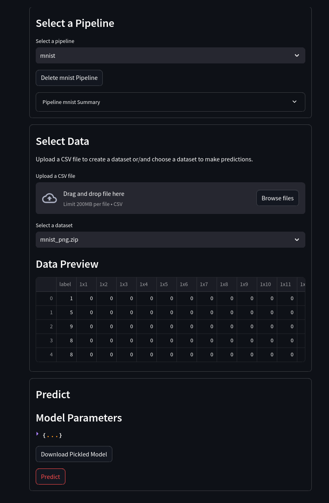

# Advanced classification use case

1. Upload mnist data set (or a zip file of images)

2. Upload a zip file of images to predict on later

3. Select parameters and execute the pipeline (important, as the labels are numerical, tick the checkbox to view them as categorical):

4. Save the pipeline

5. Predict using the uploaded images which where converted to datasets:

6. Download the predictions and/ or the model

