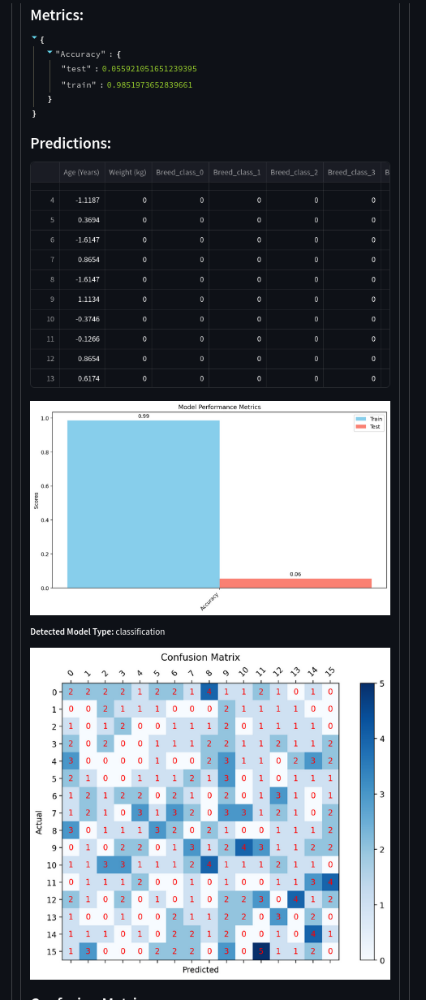

# Classification use case

1. Upload your dataset just as previously

2. Slice and save dataset

3. Use the sliced dataset to execute the pipeline:

4. View metrics and graphs

5. Optionally, save the pipeline to use for predictions under Deployment.
